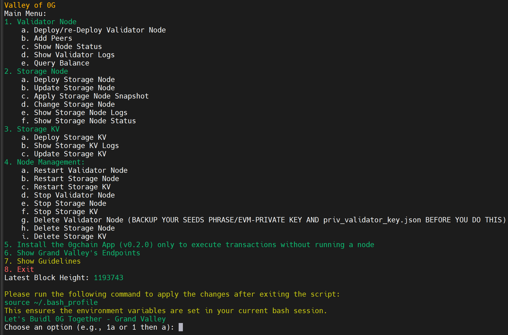

<p align="center">
  
</p>

<h1 align="center">Valley of 0G Mainnet</h1>

<p align="center">
  <strong>Toolkit for deploying and managing 0G (Zero Gravity) nodes on mainnet</strong>
</p>

<p align="center">
  <a href="https://0g.ai/" target="_blank">0G Website</a> •
  <a href="https://docs.0g.ai/" target="_blank">Official Docs</a> •
  <a href="https://discord.gg/0glabs" target="_blank">Discord</a> •
  <a href="https://github.com/hubofvalley" target="_blank">Grand Valley</a>
</p>

---

## Overview

Valley of 0G Mainnet is an open-source project by **Grand Valley** that provides automated scripts for deploying and managing 0G blockchain infrastructure, including:

- **Validator Nodes** - Full consensus client with execution layer
- **Storage Nodes** - Decentralized storage network participation
- **Storage KV** - Key-value storage service nodes

## System Requirements

### Validator Node
| Category | Requirements |
|----------|--------------|
| CPU | 8 cores |
| RAM | 64+ GB |
| Storage | 1+ TB NVMe SSD |
| Bandwidth | 100 Mbps |

### Storage Node
| Category | Requirements |
|----------|--------------|
| CPU | 8+ cores |
| RAM | 32+ GB |
| Storage | 500GB - 1TB NVMe SSD |
| Bandwidth | 100 Mbps |

### Storage KV
| Category | Requirements |
|----------|--------------|
| CPU | 8+ cores |
| RAM | 32+ GB |
| Storage | Matches KV streams maintained |

## Getting started

Run the main interactive menu:

```bash
bash <(curl -s https://raw.githubusercontent.com/hubofvalley/Mainnet-Guides/main/0g%20\(zero-gravity\)/resources/valleyof0G.sh)
```

## Available Scripts

| Script | Description |
|--------|-------------|
| [`valleyof0G.sh`](resources/valleyof0G.sh) | Main interactive menu for all operations |
| [`0g_validator_node_aristotle_install.sh`](resources/0g_validator_node_aristotle_install.sh) | Deploy validator node (Aristotle chain) |
| [`0g_validator_node_update_manual.sh`](resources/0g_validator_node_update_manual.sh) | Manual validator update |
| [`0g_storage_node_install.sh`](resources/0g_storage_node_install.sh) | Install storage node |
| [`0g_storage_node_update.sh`](resources/0g_storage_node_update.sh) | Update storage node |
| [`0g_storage_node_change.sh`](resources/0g_storage_node_change.sh) | Modify storage node config |
| [`0g_storage_kv_install.sh`](resources/0g_storage_kv_install.sh) | Install storage KV node |
| [`0g_storage_kv_update.sh`](resources/0g_storage_kv_update.sh) | Update storage KV node |
| [`apply_snapshot.sh`](resources/apply_snapshot.sh) | Apply chain snapshot |
| [`0g_node_schedule.sh`](resources/0g_node_schedule.sh) | Schedule node start/stop jobs |
| [`0g_ai_alignment_node_install.sh`](resources/0g_ai_alignment_node_install.sh) | Install an AI Alignment Node |
| [`0g_geth_to_reth_migrate.sh`](resources/0g_geth_to_reth_migrate.sh) | Migrate the execution client from Geth to Reth |
| [`0g_rollback_align.sh`](resources/0g_rollback_align.sh) | Roll back and realign consensus/execution clients |
| [`0g_standard_zgs_node_snapshot.sh`](resources/0g_standard_zgs_node_snapshot.sh) | Apply a Standard ZGS snapshot |
| [`0g_turbo_zgs_node_snapshot.sh`](resources/0g_turbo_zgs_node_snapshot.sh) | Apply a Turbo ZGS snapshot |
| [`cosmovisor_migration.sh`](resources/cosmovisor_migration.sh) | Migrate the validator service to Cosmovisor |

## Current Versions

| Component | Version |
|-----------|---------|
| Validator bundle (Aristotle) | v1.0.6 |
| 0gchaind | e8e1071 |
| Geth / Reth | 1.15.11 / 1.8.1 |
| Storage Node | v1.1.0 |
| Storage KV | v1.4.0 |
| Chain | 0gchain-16661 (Aristotle) |

## Grand Valley Public Endpoints

| Type | URL |
|------|-----|
| Cosmos RPC | `https://lightnode-rpc-mainnet-0g.grandvalleys.com` |
| EVM RPC | `https://lightnode-json-rpc-mainnet-0g.grandvalleys.com` |
| Cosmos REST API | `https://lightnode-api-mainnet-0g.grandvalleys.com` |
| Cosmos WebSocket | `wss://lightnode-rpc-mainnet-0g.grandvalleys.com/websocket` |
| EVM WebSocket | `wss://lightnode-wss-mainnet-0g.grandvalleys.com` |

## Privacy & Security

- Scripts execute locally and may install packages, create services, or modify node data.
- Treat private keys, validator keys, and JWT files as secrets. Never paste them into issues or logs.
- Review script changes before running updates, especially snapshot, migration, rollback, and deletion operations.
- Back up validator keys and configuration before destructive maintenance.
- Versions and verification status are tracked in [`VERSIONS.json`](VERSIONS.json).

## Documentation

For detailed documentation on each script, see the [docs/](docs/) folder:

- [Usage guide](docs/usage.md) - menu navigation, option reference, safety notes.
- [Validator node guide](docs/validator-node.md) - validator node setup and operational details.
- [Storage node guide](docs/storage-node.md) - storage node setup and operations.
- [Storage KV guide](docs/storage-kv.md) - Storage KV setup and maintenance.
- [Snapshot guide](docs/snapshots.md) - validator and storage snapshot safety.
- [Scheduler guide](docs/scheduler.md) - scheduled service operations.
- [Cosmovisor guide](docs/cosmovisor.md) - automatic consensus upgrades.
- [AI Alignment Node guide](docs/ai-alignment-node.md) - installation and service operations.

## Links

**0G (Zero Gravity):**
- [Website](https://0g.ai/) | [Docs](https://docs.0g.ai/) | [Discord](https://discord.gg/0glabs) | [GitHub](https://github.com/0gfoundation) | [Explorer](https://explorer.0g.ai/)

**Grand Valley:**
- [GitHub](https://github.com/hubofvalley) | [X/Twitter](https://x.com/bacvalley) | [Mainnet Guide](https://github.com/hubofvalley/Mainnet-Guides/tree/main/0g%20(zero-gravity))

## Contact

Email: letsbuidltogether@grandvalleys.com

## License

This project is licensed under the MIT License - see the [LICENSE](LICENSE) file for details.

last updated by: John
